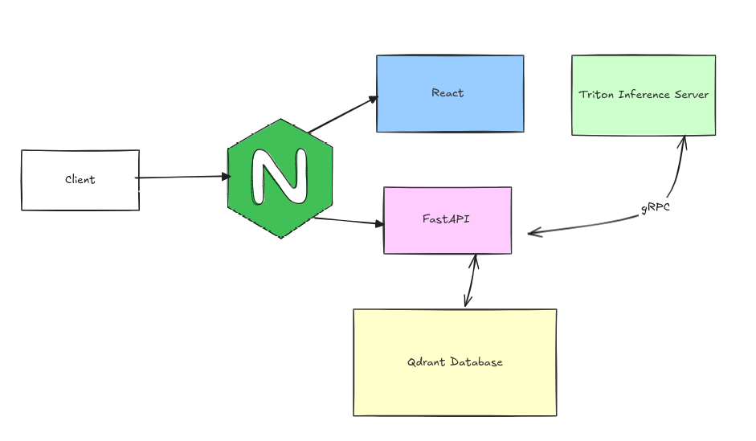
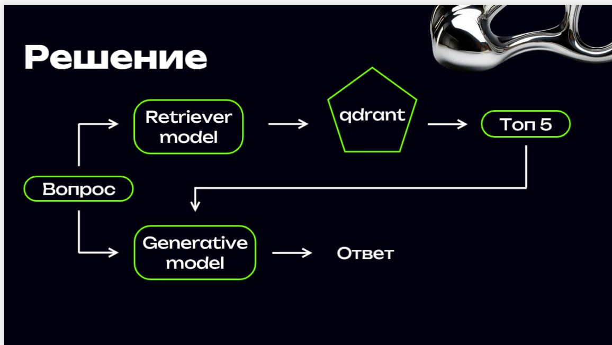

# Разработка QnA чат-бота на основе базы знаний

Команда **BLESSED** предоставляет сервис QnA чат-бота, который использует современные технологии для извлечения информации из базы знаний и генерации ответов на вопросы пользователей. Чат-бот реализован с использованием RAG-системы (retrieval-augmented generation), что позволяет повышать качество ответов и обеспечивать актуальность данных.

## Технологический стек

Для реализации решения использовались следующие технологии и инструменты:
- **Nginx** — для управления HTTP-трафиком и обратного проксирования.
- **React** — для создания интерактивного пользовательского интерфейса.
- **FastAPI** — для создания API сервиса.
- **Triton Inference Server** — для высокопроизводительного инференса моделей машинного обучения.
- **Qdrant** — для хранения и быстрого поиска векторных представлений данных.

## Архитектура решения

1. Пользователь задаёт вопрос через интерфейс чат-бота.
2. Запрос отправляется на FastAPI, который обрабатывает его и извлекает релевантные данные из базы знаний с использованием Qdrant.
3. Извлечённые данные передаются на Triton сервер для генерации ответа с использованием моделей машинного обучения.
4. Ответ возвращается пользователю через интерфейс чат-бота.
5. Все диалоги записываются и оцениваются, что позволяет отслеживать качество ответов и производить дальнейшую оптимизацию.




## Автоматическая актуализация базы знаний

В проекте реализована система автоматической актуализации базы знаний, что позволяет поддерживать информацию в актуальном состоянии и улучшать качество ответов.

## Запись диалогов

Система также ведёт учёт всех диалогов, включая оценки их качества. Записи диалогов доступны для скачивания, что позволяет анализировать взаимодействие пользователей с чат-ботом и вносить необходимые изменения для улучшения сервиса.

## Пайплайн работы приложения




---

### Размещение решения

Наше решение размещено на хосте с адресом `http://176.123.163.187/`, где вы можете получить доступ к сервису.

---


## Установка и запуск

### Необходимые требования

Перед установкой убедитесь, что у вас выполнены следующие требования:
- Установленный **CUDA** на вычислительной машине для обеспечения работы с графическими процессорами.
- Установленный **Docker** и **Docker Toolkit** для управления контейнерами.

**Запуск с Docker Compose**

   Настройте и запустите сервисы с помощью Docker Compose из корня проекта.
   ```bash
   sudo docker compose up --build
   ```


После запуска сервиса он будет доступен по адресу `http://localhost:80`.


## Контакты

Если у вас возникли вопросы или предложения, вы можете связаться с нами по следующим контактам:
- Telegram: [@D0niL19](https://t.me/D0niL19) [@Wortex04](https://t.me/Wortex04) [@AzamatSibgatullin](https://t.me/AzamatSibgatullin)

---
